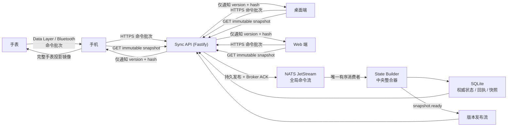

# tPlanner Sync V3 — 中央权威同步架构

> 状态:**已定稿,实施中**。本文件是 V3 同步系统的唯一权威设计文档。
> 协议 schema 与 fixtures 位于 `sync-v3/protocol/v3/`,三份分支(sync_server / mobile_andorid / master)保持逐字节一致,由 CI 校验。
> 实施按 §17 的提交计划逐项落地,每项先过局部测试。

## 1. 目标

抛弃"客户端三方合并 + 片段同步"模型,改为**中央单写者 + 命令上行 + 镜像下行**:

```
本地操作 → 本地命令 outbox → HTTPS batch → NATS JetStream 持久排序
→ 唯一 State Builder 中央裁决 → SQLite 原子提交权威状态与完整快照
→ 发布 snapshot version/hash → 所有在线终端主动下载 → 校验 → 原子安装 → ACK
```

### 不可违反的不变量

1. 只有 State Builder 可以改变权威状态。
2. 客户端上传语义命令,不上传自认为正确的完整实体副本。
3. 所有业务命令进入同一条全局有序流,不按 events/journals/lists 分权威空间。
4. 下行同步永远是完整逻辑快照,不发送远端片段。
5. 客户端不执行远端三方合并,不依据 `updatedAt` 决定覆盖。
6. Broker 序列号是并发顺序依据;客户端时间只用于显示、审计与业务时间。
7. 删除是明确的生命周期命令;被删实体只能被显式 `task.restore` 恢复。
8. Inbox/Today 只是过滤视图,不是清单实体,不进快照。
9. `groupId` 不进 V3 协议与权威快照。
10. 本地持久化后才更新 UI;中央回执/快照确认后才从 outbox 删除。
11. 任意环节崩溃允许重复执行,但不产生重复业务效果。
12. "同步成功"不由 HTTP 返回、MQ 发送成功或蓝牙写入成功单独决定。

## 2. 架构



职责边界:**MQ 负责持久化、全局排序、重投、背压;State Builder 是 MQ 的唯一消费者,负责业务整合**。业务规则不写成 broker 插件。`MQ + State Builder` 共同构成中央整合面。

## 3. 技术选型

| 层 | 选择 | 理由 |
|---|---|---|
| Broker | NATS Server 2.14 + JetStream | 单二进制、file storage、Msg-Id 去重、durable consumer |
| 运行时 | Node.js 24 LTS,纯 JS ESM(不用 TS) | 免构建部署;契约由 JSON Schema 承担 |
| HTTP | Fastify 5 | 内建 JSON Schema + Ajv 校验 |
| 校验 | JSON Schema 2020-12 + Ajv 8 | API 与 State Builder 共用同一份校验器 |
| 数据库 | SQLite + better-sqlite3 | 单写者短事务,WAL,在线 backup API |
| 规范化哈希 | RFC 8785 (JCS) + `canonicalize` | canonical hash 的唯一正确实现方式 |
| 压缩 | zlib gzip | 首版够用;超阈值走 chunk manifest,协议不变 |
| ID | UUIDv7 | 服务器/桌面用 `uuid` 包;Android 本地 25 行实现 |
| 手机 HTTP | OkHttp + kotlinx.serialization | 仅 4 个端点,不引 Retrofit |
| 桌面/Web 存储 | RxDB / Dexie 新表 | 复用现有存储 |
| 手表 outbox | Room(给 wear 模块补 room + ksp) | 序列、回执、事务需要真 DB |
| TLS | Caddy 自动 HTTPS | 反代 API;NATS 只监听 127.0.0.1 |
| 日志 | pino → journald | 结构化,映射 §16 字段 |
| 进程管理 | systemd 三单元 + `tplanner` 用户 | 不用 pm2 / Docker |
| 测试 | node:test + 协议 fixtures | 确定性 = 重放命令序列比对 hash |
| 备份 | SQLite backup 每小时 + restic 异机每日 | JetStream 配置一并导出 |

明确不选:RabbitMQ(Erlang 运维重)、Redis Streams(内存优先)、MQTT(无全局序与 durable consumer)、Kafka(单机过重)、TypeScript(免构建优先)、Docker(SD 卡场景)、Prometheus(首版三个 JSON 端点足够)、SSE(首版长轮询,不是瓶颈)。

## 4. 上行协议:命令批次

```json
{
  "protocolVersion": 3,
  "batchId": "0198f2...uuidv7",
  "deviceId": "desktop-7c...",
  "firstClientSequence": 421,
  "lastClientSequence": 424,
  "baseSnapshotVersion": 812,
  "commands": [
    {
      "commandId": "0198f2...01",
      "clientSequence": 421,
      "type": "task.setCompleted",
      "aggregateId": "task-123",
      "arguments": { "completed": true }
    },
    {
      "commandId": "0198f2...02",
      "clientSequence": 422,
      "type": "checklist.setCompleted",
      "aggregateId": "task-456",
      "arguments": { "checklistItemId": "item-7", "completed": true }
    }
  ]
}
```

规则:

- `commandId` 永久唯一(UUIDv7);`batchId` 负责网络重试与 broker 去重。
- `clientSequence` 是设备本地单调递增序列;batch 必须连续覆盖 `firstClientSequence..lastClientSequence`。
- 一个设备串行上传 batch;前一个未获 broker ACK 不上传下一个。
- `baseSnapshotVersion` 仅作审计,不参与冲突解决。
- 用 `SetCompleted(true/false)`,不用 Toggle;重试与 pending overlay 都幂等。
- 文本框 focus 丢失或 Done 生成一条 `setText`;每个 checklist 勾选是独立命令,传输层可合入同一 batch。

### 命令清单(首批)

```text
task.create / setTitle / setNote / setSchedule / setCompleted / delete / restore / changeType / setRecurrence / assignList / moveInTimeline
checklist.createItem / setTitle / setCompleted / deleteItem / reorderItem
list.create / rename / setColor / delete
journal.setText / delete
goal.create / patch / delete
insight.upsert / delete
```

`task.changeType` 的字段保留规则只存在于中央 reducer。

## 5. 全局排序与中央裁决

State Builder 以 MQ stream sequence 为唯一全局顺序。裁决规则:

| 情况 | 中央处理 |
|---|---|
| 两端改不同字段 | 按 broker 顺序分别应用,都保留 |
| 两端改同一字段 | broker sequence 更后者为最终值 |
| 重复 commandId | 返回原回执,不重复执行 |
| 重复设置相同值 | `NOOP`,不生成新快照 |
| 普通编辑命中已删实体 | `ENTITY_DELETED`,不复活 |
| 两端同时删除 | 第一个删除,第二个 `NOOP_ALREADY_DELETED` |
| 创建相同实体 ID | 相同 create 为重复;不同 create 为 `ID_ALREADY_EXISTS` |
| 删除自定义清单 | 中央 reducer 将其任务转未分配;Inbox/Today 不参与 |
| stale 客户端改标题 | 按中央顺序设置该字段,不影响其他字段 |
| clientSequence 缺口 | batch 拒绝 `SEQUENCE_GAP`,客户端重传 |
| 非法 schema/字段 | 终态拒绝,写回执,不阻塞后续消息 |
| 整合器内部错误 | 不 ACK,停止消费等待重投,不跳过 |

PC 人工冲突选择不再作为同步机制;可保留历史版本入口,恢复生成新命令,不倒退快照版本。

## 6. 整合窗口与发布边界

```
收到首条 MQ 消息 → 开始 integration batch
→ 距最后一条安静 100ms 结束 | 自首条起 5s 强制结束 | 100 条命令 | 256 KiB
```

> nats.js v3 的 pull consumer 要求 `expires >= 1000ms`。State Builder 只保持一个
> 在途 pull，并用本地 100ms timer 截断当前 integration batch；未完成的 pull
> 复用于下一批，因此不会丢消息或乱序，也不会把孤立命令固定延迟一秒。

然后:按 MQ sequence 排序 → 去重 → 顺序执行 reducer → 单 SQLite 事务写实体/回执/快照/发布 outbox → 提交 → 更新内存缓存 → 发布 `snapshot.ready` → ACK 本批消息。

客户端可跳过中间版本:V815 是完整快照,收到 V813 后紧跟 V815 只装 V815。

## 7. 快照是唯一的下行数据

```json
{
  "snapshotSchemaVersion": 3,
  "snapshotVersion": 813,
  "parentVersion": 812,
  "serverInstanceId": "srv-...",
  "brokerFromSequence": 10321,
  "brokerToSequence": 10328,
  "createdAt": "2026-08-19T12:34:56.789Z",
  "state": {
    "tasks": {}, "customLists": {}, "journals": {}, "goals": {}, "insights": {}
  }
}
```

快照不包含:Inbox/Today 实体、`groupId`、UI 展开状态、编辑焦点、设备密钥、AI 密钥、蓝牙信息、各设备 pending command。

每个 task 始终是完整 canonical 实体，即使字段仍为默认值也不得省略：
`title`、`note`、`completed`、`itemType`、`schedule`、`recurrence`、
`alarm`、`colorId`、`location`、`extras`、`listId`、`checklist`、
`lifecycle`、`deletedAt`。未排程/未循环/未分配清单分别明确写为 `null`；
空 extras/checklist 明确写为 `{}`/`[]`。`list.delete` 将引用设为
`listId: null`，不得通过删除属性表达同一状态。

manifest 与数据分离:`{ snapshotVersion, parentVersion, stateHash, compressedHash, encoding, compressedBytes, schemaVersion }`。

`stateHash` 只覆盖 canonical 化的 `state` 对象(RFC 8785 JCS);信封元数据(`createdAt`、`serverInstanceId`、broker 序列)不参与,保证同一条命令流重放任意次 hash 一致。实体 payload 不携带墙钟时间戳,排序与"最后修改"以 broker sequence 为准,展示时间由客户端本地覆盖。

客户端安装(staging + 原子切换):

1. 下载解析在临时区完成,失败旧快照不动;
2. 校验 compressedHash → 解压 → 校验 canonical stateHash → 校验 schemaVersion;
3. 数据库事务:替换 Server Mirror → 重放未被中央确认的 pending commands → 写 `installedVersion` → 提交;
4. UI 一次性切换。终端永远看不到"事项更新了但清单还没更新"的半版本。

## 8. 本地 pending 与镜像替换共存

客户端两层:

```text
Server Mirror              最近安装的中央快照
Pending Command Overlay    已本地提交、尚未获中央确认的命令
Displayed State = reduce(Server Mirror, Pending Command Overlay)
```

安装 V813 时:查询回执 → 删除 `publishedSnapshotVersion <= 813` 的 pending → 替换镜像 → 剩余 pending 按 clientSequence 重放到 V813 上 → 原子提交。本地 optimistic reducer 只是预览,权威永远来自中央快照。

## 9. 数据库(State Builder / SQLite)

```sql
CREATE TABLE processed_commands (
    command_id TEXT PRIMARY KEY, batch_id TEXT NOT NULL, device_id TEXT NOT NULL,
    client_sequence INTEGER NOT NULL, broker_sequence INTEGER NOT NULL UNIQUE,
    command_type TEXT NOT NULL, aggregate_id TEXT, status TEXT NOT NULL,
    error_code TEXT, snapshot_version INTEGER, result_json TEXT, processed_at INTEGER NOT NULL
);
CREATE UNIQUE INDEX processed_commands_device_sequence
    ON processed_commands(device_id, client_sequence);

CREATE TABLE entities (
    entity_type TEXT NOT NULL, entity_id TEXT NOT NULL, lifecycle TEXT NOT NULL,
    payload_json TEXT NOT NULL, last_broker_sequence INTEGER NOT NULL,
    created_at INTEGER NOT NULL, updated_at INTEGER NOT NULL, deleted_at INTEGER,
    PRIMARY KEY(entity_type, entity_id)
);

CREATE TABLE snapshots (
    version INTEGER PRIMARY KEY, parent_version INTEGER,
    broker_from_sequence INTEGER NOT NULL, broker_to_sequence INTEGER NOT NULL,
    schema_version INTEGER NOT NULL, state_hash TEXT NOT NULL UNIQUE,
    compressed_hash TEXT NOT NULL, compressed_payload BLOB NOT NULL,
    uncompressed_bytes INTEGER NOT NULL, compressed_bytes INTEGER NOT NULL,
    created_at INTEGER NOT NULL
);

CREATE TABLE latest_snapshot (
    singleton_id INTEGER PRIMARY KEY CHECK(singleton_id = 1),
    version INTEGER NOT NULL, state_hash TEXT NOT NULL
);

CREATE TABLE device_progress (
    device_id TEXT PRIMARY KEY, accepted_client_sequence INTEGER NOT NULL DEFAULT 0,
    installed_snapshot_version INTEGER NOT NULL DEFAULT 0,
    installed_snapshot_hash TEXT, last_seen_at INTEGER NOT NULL,
    protocol_version INTEGER NOT NULL
);

CREATE TABLE publication_outbox (
    publication_id TEXT PRIMARY KEY, publication_type TEXT NOT NULL,
    dedupe_key TEXT NOT NULL UNIQUE, payload_json TEXT NOT NULL,
    state TEXT NOT NULL, attempt_count INTEGER NOT NULL DEFAULT 0,
    next_attempt_at INTEGER NOT NULL DEFAULT 0, created_at INTEGER NOT NULL,
    published_at INTEGER
);
```

PRAGMA:`journal_mode = WAL; synchronous = FULL; foreign_keys = ON; busy_timeout = 5000;`

### writer lease(双整合器防护)

`state_builder_lease` 单行表:`BEGIN IMMEDIATE` 抢占成功**之后**才 attach NATS durable consumer;systemd 单实例 + 文件锁兜底。第二个实例因 lease 失败退出,绝不允许两个消费者同时消费命令流。

## 10. 崩溃一致性(inbox/outbox)

消费:`拉取 → BEGIN IMMEDIATE → 查 commandId → reducer → 写 entities/回执/快照/latest/发布outbox → COMMIT → ACK MQ`

| 崩溃点 | 恢复 |
|---|---|
| DB commit 前 | MQ 重投,重新执行 |
| DB commit 后、ACK 前 | 重投,command_id 已存在,返回原结果 |
| ACK 后 | 已提交,不丢 |
| 快照提交后、ready 前 | publication_outbox 重启后补发 |
| ready 后、outbox 标记前 | 重复发布,MQ 与客户端按版本去重 |
| 客户端下载后、安装前 | 保留旧镜像,重启重下 |
| 安装后、ACK 前 | 重启补发 ACK |

语义:**at-least-once 传输 + 永久业务幂等 = 每条命令状态效果恰好一次**。不宣称全链路 exactly-once。

## 11. API

| 端点 | 说明 |
|---|---|
| `GET /tplanner/v3/capabilities` | software/protocol/schema 版本、serverInstanceId、latestSnapshotVersion、批次上限 |
| `POST /tplanner/v3/command-batches` + `Idempotency-Key: batchId` | 返回 `{batchId, brokerSequence, state: BROKER_PERSISTED}` |
| `GET /tplanner/v3/receipts?afterClientSequence=N` | `{acceptedThrough, results[]}` |
| `GET /tplanner/v3/snapshots/latest` | `Cache-Control: no-store` |
| `GET /tplanner/v3/snapshots/{version}` | `ETag: compressedHash`,`immutable`,`Content-Type: application/gzip`;不设置 `Content-Encoding`，确保浏览器返回可校验 `compressedHash` 的原始压缩字节；只允许 private cache |
| `GET /tplanner/v3/notifications?afterVersion=N&wait=25000` | 长轮询,只返回 version+hash |
| `POST /tplanner/v3/devices/{deviceId}/snapshot-acks` | `{version, stateHash}` |

回执状态:`APPLIED / NOOP / REJECTED / SEQUENCE_GAP / ENTITY_DELETED / ID_ALREADY_EXISTS / SCHEMA_UNSUPPORTED`。

`serverInstanceId` 变化 = 数据宇宙重建,客户端必须重新 bootstrap。

### 已定决策(评审结论)

- **设备重置**:deviceId 每次安装新生成且永不随备份恢复；服务器不提供 reset 端点，新安装以新 deviceId 从 clientSequence 1 开始。
- **旧数据集协议已退役**:8.0.0 不再注册 dataset GET/PUT、changes 或兼容 adapter；`/health` 仅作为 V3 readiness 别名保留。
- **循环任务展开(8.0.0 契约)**:客户端在首次创建时以确定性 ID 展开成独立 `task.create` facts；中央只权威保存每个事实的 recurrence 字段，不再二次展开，避免生成双份实例。
- **canonical hash**:RFC 8785 (JCS)。
- **日边界时区**:journal 切日与 watch projection 分桶固定按 Asia/Shanghai 计算,写入 schema 说明。
- **checklist.reorderItem**:用"移到某 item 之前"的 token 语义,不用绝对下标。
- **task.setSchedule 与 task.moveInTimeline**:`setSchedule` 是时间字段的权威命令;`moveInTimeline` 只表达相对位移意图,中央据 setSchedule 结果归一化。

## 12. 同步状态分层与错误码

内部状态:`LOCAL_COMMITTED → BROKER_PERSISTED → SNAPSHOT_PUBLISHED → LOCAL_SNAPSHOT_INSTALLED → ALL_ONLINE_DEVICES_INSTALLED`。

| 内部状态 | 用户可见 |
|---|---|
| LOCAL_COMMITTED | 已保存,等待同步 |
| BROKER_PERSISTED | 已上传,正在整合 |
| SNAPSHOT_PUBLISHED 本机未装 | 正在更新 |
| LOCAL_SNAPSHOT_INSTALLED 且无 pending | 同步成功 |
| 其他在线设备未装 | 本机已同步,其他设备待更新 |
| 网络不可用 | 已离线保存 |
| 终态错误 | 同步失败(ERRORxxx) |

错误码:`ERROR001` 无网络 / `ERROR002` 无法连接服务器 / `ERROR003` Broker 未接受 / `ERROR004` 整合器积压 / `ERROR005` 镜像下载失败 / `ERROR006` hash 校验失败 / `ERROR007` 本地安装失败 / `ERROR008` 协议或 schema 不兼容 / `ERROR009` 命令被中央拒绝 / `ERROR010` 认证失败。

UI 只显示短码;URL、栈、batchId、commandId、brokerSequence、snapshotVersion 进日志。

手机三秒动画只是最短展示:`UI 结束 = max(动画开始 + 3s, 实际完成时间)`。

## 13. 手表投影

手表不直连服务器,手机是 gateway,收完整 projection image(全局快照派生的完整投影,非片段):

```json
{ "projectionSchemaVersion": 3, "parentSnapshotVersion": 813, "projectionVersion": 227, "hash": "...", "days": [ { "date": "2026-08-19", "tasks": [] } ] }
```

上行:`Watch outbox → Data Layer →(失败)RFCOMM → Phone 持久化 → STORED receipt → 手机上传 MQ`。同一 commandId 双通道只落一次;手表收到 `PHONE_STORED` 才可标记,`SNAPSHOT_PUBLISHED` 由手机带回。

## 14. 缓存

- 服务器:latest manifest + 最近 3–5 个压缩快照 Buffer + 回执热点 LRU;`SQLite commit → outbox → ready → 读取 → 校验 hash → 原子换 latest 指针`;重启从 SQLite 恢复。
- 客户端:已装 Server Mirror + 本地 Command Overlay + 最近 manifest/hash;不缓存服务器部分结果。
- 扩展条件(任一):压缩快照 > 2 MiB、构建 p95 > 50ms、安装 p95 > 300ms、单次下载成为主要耗时。扩展方式 = Snapshot Manifest 引用多个内容寻址 immutable chunks,客户端补缺 chunk 后整体切换,仍不允许把单个 chunk 当独立版本。

## 15. 部署(树莓派)

```
/opt/tplanner-sync/            应用代码
/var/lib/tplanner-sync/        state/tplanner.db, jetstream/, backups/   ← 建议 SSD,勿用 SD 卡
/var/log/tplanner-sync/        可选,优先 journald

nats-server.service
  ├─ tplanner-state-builder.service
  └─ tplanner-sync-api.service
Caddy: 443 → 127.0.0.1:37401 自动证书;NATS 监听 127.0.0.1:4222,监控 127.0.0.1:8222
```

统一 `tplanner` 用户(不再用 hamhuo / Documents)。健康检查:`/health/live`、`/health/ready`(broker 连接、stream、SQLite、latest 快照、lease 期内)、`/tplanner/v3/status`(latestVersion、brokerLastSequence、materializedThroughSequence、queueLag)。

单机 JetStream 防进程重启与网络抖动,不防 SD 卡整体损坏;主机级容灾需三节点 broker 或异机备份。

## 16. 日志与可观测性

共享字段:`traceId / deviceId / batchId / commandId / clientSequence / brokerSequence / snapshotVersion / projectionVersion`。严禁记录日记正文、note 全文、AI 密钥、Authorization、完整快照。

## 17. 迁移、回滚与兼容

### 8.0.0 权威字段迁移

维护窗口中停止 API 与 State Builder → 生成并校验 SQLite Online Backup →
等待 writer lease 失效 → 运行 `scripts/migrate-canonical-task-fields.mjs` →
逐任务把 checklist `text` 归一为 `title`、root `start/end` 提升为
`schedule {startAt,endAt}`、root `type` 提升为 `itemType`，并把
recurrence/alarm/location 纳入正式模型；timezone、extras 与未知字段无损保留 →
同一事务发布新快照 → 按 NATS、Builder、API 顺序启动并 smoke test。

旧数据集兼容窗口已经结束。恢复到会重新开放整库 PUT 的版本不再是受支持的回滚路径。

### 回滚

- 只能回滚到兼容 V3 协议、且不会重新开放整库 PUT 的版本。DB migration 必须可重放；从 `materializedThroughSequence + 1` 续消费。DB 损坏则恢复已校验的 SQLite backup 再从 JetStream 重放；版本号只能前进。客户端获 `BROKER_PERSISTED` 前不删 outbox，正是为此。

## 18. 实施计划(66 提交,里程碑化)

- **M1 sync_server**:A 协议(1–5)+ B 服务器(6–27)已完成；8.0.0 已删除过渡兼容层。
- **M2 master 桌面/Web**(42–53):改动最小、调试最快,先当小白鼠。
- **M3 mobile_andorid 手机 + 手表桥接**(28–41, 54–61):一起做,手表走手机。
- **M4 Web 收尾**:与 Electron 共用协议层。
- **M5 清理**(62–66):观察期结束，8.0.0 完成旧协议退役。

A. 协议与共享规范:1 `docs(sync-v3)` 架构文档 · 2 command-batch/receipt schema · 3 snapshot schema · 4 跨平台协议 fixtures · 5 确定性 reducer fixtures。
B. sync_server:6 NATS 配置 · 7 用户与目录规范化 · 8 broker 发布器 · 9 命令入口端点 · 10 SQLite schema/migration · 11 历史数据一次性导入(已删除 importer) · 12 幂等回执 · 13 确定性 task reducer · 14 list/journal/goal/insight reducers · 15 有序 materializer · 16 不可变快照生成 · 17 事务发布 outbox · 18 snapshot.ready 发布 · 19 快照与回执 API · 20 设备进度 · 21 过渡兼容层(8.0.0 已退役并删除) · 22 快照缓存与条件下载 · 23 指标与状态端点 · 24 备份工具 · 25 重复投递与崩溃恢复测试 · 26 并发排序测试 · 27 Pi 负载压测。
C. mobile_andorid:28 命令 outbox schema · 29 本地 optimistic reducer · 30 任务写入走命令仓库 · 31 journal/list 写入走命令 · 32 上传批次 · 33 回执与进度持久化 · 34 快照下载校验 · 35 快照原子安装 + pending overlay · 36 版本通知替换数据集监听 · 37 删除操作后 fetchEvents · 38 单一队列泵替换 worker 链 · 39 分级状态与错误码 · 40 快照安装与 pending 重放测试 · 41 离线删除不复活测试。
D. master:42 IndexedDB outbox 与元数据 · 43 本地 optimistic reducer · 44 写路径走命令仓库 · 45 批次上传 · 46 快照原子安装 · 47 通知与回执持久化 · 48 Web 共用镜像与 outbox · 49 移除三方合并 · 50 移除 save 前 GET 整库 · 51 移除 Promise 全量同步链 · 52 冲突弹窗改历史/拒绝提示 · 53 并发命令与快照替换测试。
E. 手表与桥接:54 共享命令信封 · 55 每连接批发送 · 56 手机幂等持久化桥接命令 · 57 手表 PHONE_STORED/SNAPSHOT_PUBLISHED 回执 · 58 手机从全局快照构建手表投影 · 59 手表投影原子安装 · 60 双通道去重测试 · 61 断连保 pending 测试。
F. 部署与清理:62 独立部署入口 · 63 systemd 健康与重启策略 · 64 运维与灾备 runbook · 65 过渡写入已禁用 · 66 8.0.0 已删除旧全量合并协议、路由与回滚脚本。

## 19. 故障测试与验收

### 必须覆盖

- **Broker/API**:重复 POST 相同 batchId ×100;broker 停 30s 客户端继续操作;磁盘 80/95/100%;API-broker 断连;两设备并发上传。
- **State Builder**:事务前/中/后崩溃;ACK 前崩溃;ready 前崩溃;重复 commandId;malformed command;reducer 内部错误;第二实例启动;sequence gap 停止不跳过。
- **并发业务**:双端改同标题;标题+勾选并发;note 编辑与删除并发;离线创建撞 ID;删清单与 assign 并发;checklist 删除与勾选并发;类型转换与 checklist 编辑并发;删除后旧客户端上传编辑;restore 后再编辑;双端时钟差一天仍按 broker 序。
- **快照**:同状态两次序列化 hash 一致;gzip 损坏;下载截断;manifest/payload version 不符;安装事务中断;schema 不支持;迟到 V814 忽略;安装期间新版本发布;安装与本地命令并发不丢 pending。
- **手表**:Data Layer 成功但 receipt 丢;双通道同时到达;手机已存但断网;创建后立即删除;projection ACK 丢;手机重发同 projection;旧 projection 等待 ACK 时新 projection 就绪;蓝牙慢/半包/断包/超时。

### 指标

- 本地操作 → UI 更新 p95 < 50ms,不等网络。
- 命令 → broker ACK:局域网 p95 < 150ms,互联网 p95 < 500ms。
- 命令入 broker → 快照发布 p95 < 500ms。
- 在线设备安装:局域网 p95 < 1s,互联网 p95 < 2s。
- 稳态无整库 GET/PUT;queue oldest age < 1s(告警 > 10s,严重 > 60s);snapshot 构建 p95 < 50ms;SQLite commit p95 < 100ms;latest 缓存命中 > 99%;单次操作上行 < 5 KiB。
- 重复命令不重复任务;删除不被旧编辑复活;同流重放任意次 hash 相同;同版本各端 canonical hash 一致;crash 注入后命令要么在客户端/MQ 要么在回执里。

## 20. 明确废弃(完成 V3 后删除)

客户端三方合并;本地/远端人工裁决;updatedAt LWW;`/tplanner/time` 热路径;每次操作 GET/PUT 整库;数据集名型 `/changes` 通知;内存 change revision;desktop Promise full-sync chain;mobile 每操作一个 WorkManager successor;操作后直接 fetchEvents;Web GET-before-save;服务端 JSON 全文件重写;30 天 tombstone 作为删除正确性唯一保障;多端各自实现 canonical merge;仅凭请求发出/蓝牙连接成功显示的同步成功。
